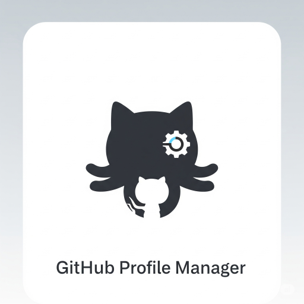

<!-- Improved compatibility of back to top link: See: https://github.com/othneildrew/Best-README-Template/pull/73 -->

[![Contributors][contributors-shield]][contributors-url]
[![Forks][forks-shield]][forks-url]
[![Stargazers][stars-shield]][stars-url]
[![Issues][issues-shield]][issues-url]
[![project_license][license-shield]][license-url]

 

  

<h3 align="center">GitHub Profile Manager</h3>

  

    Automate your GitHub profile README with dynamic featured projects and 3D contribution graphs using GitHub Actions workflows.
     
    <a href="https://github.com/LoveDoLove/Github-Profile-Manager"><strong>Explore the docs »</strong></a>
     
     
    <a href="https://github.com/LoveDoLove/Github-Profile-Manager">View Demo</a>
    &middot;
    <a href="https://github.com/LoveDoLove/Github-Profile-Manager/issues/new?labels=bug&template=bug-report---.md">Report Bug</a>
    &middot;
    <a href="https://github.com/LoveDoLove/Github-Profile-Manager/issues/new?labels=enhancement&template=feature-request---.md">Request Feature</a>
  

  
Table of Contents

  <ol>
    <li>
      <a href="#about-the-project">About The Project</a>
      <ul>
        <li><a href="#built-with">Built With</a></li>
      </ul>
    </li>
    <li>
      <a href="#getting-started">Getting Started</a>
      <ul>
        <li><a href="#prerequisites">Prerequisites</a></li>
        <li><a href="#installation">Installation</a></li>
      </ul>
    </li>
    <li><a href="#usage">Usage</a></li>
    <li><a href="#contributing">Contributing</a></li>
    <li><a href="#license">License</a></li>
    <li><a href="#contact">Contact</a></li>
    <li><a href="#acknowledgments">Acknowledgments</a></li>
  </ol>

## About The Project

**GitHub Profile Manager** automates your GitHub profile README by dynamically updating featured repositories based on stars and displaying a 3D contribution graph. All updates are handled via GitHub Actions workflows—no manual script running required.

(<a href="#readme-top">back to top</a>)

### Built With

- 
- 
- 

(<a href="#readme-top">back to top</a>)

## Getting Started

### Prerequisites

- A GitHub repository with a profile README (e.g., `<username>/<username>`)
- GitHub Actions enabled

### Installation

1. Copy the workflow YAML files from the `workflows/` directory into your repository's `.github/workflows` directory:
   - [`generate-3d-contribution-graph.yml`](workflows/generate-3d-contribution-graph.yml)
   - [`sync-top-starred-projects.yml`](workflows/sync-top-starred-projects.yml)
2. (Optional) Add a repository environment variable named `EXCLUDE_REPOS` in your GitHub repository settings to exclude specific repositories from the featured list. Use a comma-separated list (e.g., `repo1,repo2`).

(<a href="#readme-top">back to top</a>)

## Usage

- **Automatic Featured Projects:**  
  The `sync-top-starred-projects.yml` workflow will automatically update your profile README with your top-starred repositories on a schedule or on demand.
- **Exclude Repositories:**  
  To skip certain repositories, set the `EXCLUDE_REPOS` repository environment variable in your GitHub settings.
- **3D Contribution Graph:**  
  The `generate-3d-contribution-graph.yml` workflow generates a 3D contribution graph SVG, which you can embed in your profile README.
- **No Manual Script Running:**  
  All updates are handled by GitHub Actions; you do not need to run scripts locally.

_For more examples, refer to the [Documentation](https://github.com/LoveDoLove/Github-Profile-Manager)_

(<a href="#readme-top">back to top</a>)

## Contributing

Contributions are what make the open source community such an amazing place to learn, inspire, and create. Any contributions you make are **greatly appreciated**.

If you have a suggestion that would make this better, please fork the repo and create a pull request. You can also simply open an issue with the tag "enhancement".  
Don't forget to give the project a star! Thanks again!

1. Fork the Project
2. Create your Feature Branch (`git checkout -b feature/AmazingFeature`)
3. Commit your Changes (`git commit -m 'Add some AmazingFeature'`)
4. Push to the Branch (`git push origin feature/AmazingFeature`)
5. Open a Pull Request

(<a href="#readme-top">back to top</a>)

### Top contributors:

## License

Distributed under the MIT License. See `LICENSE` for more information.

(<a href="#readme-top">back to top</a>)

## Contact

LoveDoLove - [@LoveDoLove](https://twitter.com/LoveDoLove) - lovedolove@gmail.com

Project Link: [https://github.com/LoveDoLove/Github-Profile-Manager](https://github.com/LoveDoLove/Github-Profile-Manager)

(<a href="#readme-top">back to top</a>)

## Acknowledgments

- [Best-README-Template](https://github.com/othneildrew/Best-README-Template)
- [contrib.rocks](https://contrib.rocks/)
- [GitHub Actions](https://github.com/features/actions)

(<a href="#readme-top">back to top</a>)

<!-- MARKDOWN LINKS & IMAGES -->

[contributors-shield]: https://img.shields.io/github/contributors/LoveDoLove/Github-Profile-Manager.svg?style=for-the-badge
[contributors-url]: https://github.com/LoveDoLove/Github-Profile-Manager/graphs/contributors
[forks-shield]: https://img.shields.io/github/forks/LoveDoLove/Github-Profile-Manager.svg?style=for-the-badge
[forks-url]: https://github.com/LoveDoLove/Github-Profile-Manager/network/members
[stars-shield]: https://img.shields.io/github/stars/LoveDoLove/Github-Profile-Manager.svg?style=for-the-badge
[stars-url]: https://github.com/LoveDoLove/Github-Profile-Manager/stargazers
[issues-shield]: https://img.shields.io/github/issues/LoveDoLove/Github-Profile-Manager.svg?style=for-the-badge
[issues-url]: https://github.com/LoveDoLove/Github-Profile-Manager/issues
[license-shield]: https://img.shields.io/github/license/LoveDoLove/Github-Profile-Manager.svg?style=for-the-badge
[license-url]: https://github.com/LoveDoLove/Github-Profile-Manager/blob/master/LICENSE
[linkedin-shield]: https://img.shields.io/badge/-LinkedIn-black.svg?style=for-the-badge&logo=linkedin&colorB=555
[linkedin-url]: https://linkedin.com/in/lovedolove
[product-screenshot]: images/screenshot.png
